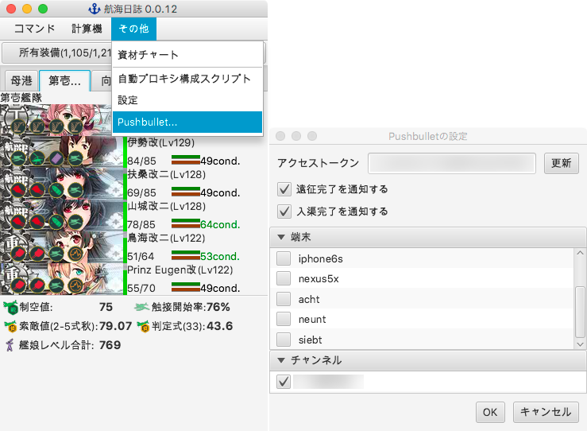

logbook-kai-plugins
-------------------

sanaehirotakaさんの航海日誌 ([logbook-kai](https://github.com/sanaehirotaka/logbook-kai)) へのプラグイン集。

## Pushbulletプラグイン

航海日誌に[Pushbullet](https://www.pushbullet.com/)を使って遠征・入渠の完了をプッシュ通知する機能を追加します。  

### インストール方法

[Releases](https://github.com/rsky/logbook-kai-plugins/releases)より **pushbullet.jar** をダウンロードして航海日誌の **plugins** フォルダに入れ、航海日誌を再起動してください。

### 設定方法

1. 「その他」メニュー内の「Pushbullet」よりPushbulletの設定ウインドウを開きます。
2. Pushbulletの管理画面で取得したアクセストークンを入力し、「更新」ボタンを押します。
3. 登録されている端末およびチャンネルのリストが表示されるので、プッシュ通知したい対象をチェックして「OK」を押せば設定完了です。

### 使用ライブラリとライセンス

以下のライブラリを使用しています。

#### [Retrofit](http://square.github.io/retrofit/)

- [Apache License 2.0](http://square.github.io/retrofit/#license)

#### [RxJavaFX](https://github.com/ReactiveX/RxJavaFX)

- [Apache License 2.0](https://github.com/ReactiveX/RxJavaFX/blob/2.x/LICENSE)

#### [Lombok](https://projectlombok.org/)

- [MIT License](https://github.com/rzwitserloot/lombok/blob/master/LICENSE)

## 戦果チャートプラグイン

閲覧した提督ランキングのうち1/5/20/100/500位と自分の戦果を記録し、グラフと表で見る機能を追加します。

表を右クリックすると選択行をTSV形式でクリップボードにコピーや、表示中の範囲をCSVとして保存するコンテキストメニューが表示されます。

チャートは単月表示のほか、前月/前(四半)期/前年と比較表示するモードもあります。

### インストール方法

[Releases](https://github.com/rsky/logbook-kai-plugins/releases)より **rankingchart.jar** をダウンロードして航海日誌の **plugins** フォルダに入れ、航海日誌を再起動してください。

**インストール直後は戦果係数がないため、戦果を記録できません。ランキング1位から100位まで(1-10ページ)を閲覧すると自動で戦果係数が計算され、戦果を記録できるようになります。** もしそれでも記録できていないなら、下記手順に従って手動で戦果係数を設定してください。

※メンテナンス後は戦果係数が変化しており、自動または手動で戦果係数を更新する必要がある場合が多いです。

### 戦果係数の手動設定方法

1. ブラウザで艦これの「マイランク」を表示します。
2. 「その他」メニュー内の「戦果チャート」より戦果チャートウインドウを開きます。
3. 「設定..」ボタンより戦果チャートの設定ウインドウを開きます。
4. 「順位」欄に自分の順位が入力されていることを確認したら、「実戦果」欄に自分の戦果を半角数字で入力して「戦果係数を更新」ボタンを押せば設定完了です。いったん戦果チャートウインドウを閉じてください。

### 使用ライブラリとライセンス

以下のライブラリを使用しています。

#### [SQLite JDBC Driver](https://github.com/xerial/sqlite-jdbc)

- [Apache License 2.0](https://github.com/xerial/sqlite-jdbc/blob/master/LICENSE)

#### [Lombok](https://projectlombok.org/)

- [MIT License](https://github.com/rzwitserloot/lombok/blob/master/LICENSE)

## ビルド方法

`lib` フォルダに航海日誌の `logbook-kai.jar` を入れて `mvn package`

## 宣伝

[航海日誌のmacOS用.appを作るツール](https://github.com/rsky/logbook-packager)あります。
